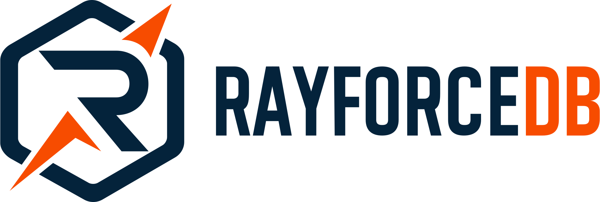
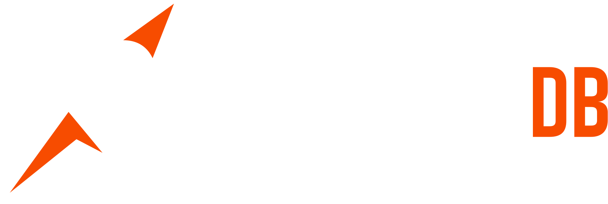

---
hide:
  - navigation
  - toc
---

<div class="hero-section" markdown>
<div class="hero-content" markdown>

{ .hero-logo .light-only }
{ .hero-logo .dark-only }

# Safe **Rust** bindings for RayforceDB

The ultra-fast columnar database, now with Rust's safety guarantees. Zero-cost abstractions, memory safety, and fearless concurrency.

<div class="hero-socials" markdown>
[:fontawesome-brands-github:](https://github.com/RayforceDB/rayforce-rs "GitHub")
[:fontawesome-brands-rust:](https://crates.io/crates/rayforce "Crates.io")
[:fontawesome-brands-x-twitter:](https://x.com/RayforceDB "X (Twitter)")
[:fontawesome-brands-reddit:](https://www.reddit.com/r/rayforcedb/ "Reddit")
</div>

<div class="hero-buttons">
<a href="content/get-started/overview/" class="md-button md-button--primary">Get Started</a>
<a href="content/api/overview/" class="md-button">API Reference</a>
<a href="https://github.com/RayforceDB/rayforce-rs" class="md-button">View on GitHub</a>
</div>

</div>

<div class="hero-ticker">
<div class="hero-ticker__content">
<span>🦀 Safe & Sound</span>
<span>⚡ Blazing Fast</span>
<span>📊 Columnar Storage</span>
<span>🔧 Zero Dependencies</span>
<span>🧠 In-Process Embedding</span>
<span>🚀 Sub-millisecond Queries</span>
<span>💾 Tiny Binary</span>
<span>🔒 Memory Safe</span>
<span>🦀 Safe & Sound</span>
<span>⚡ Blazing Fast</span>
<span>📊 Columnar Storage</span>
<span>🔧 Zero Dependencies</span>
<span>🧠 In-Process Embedding</span>
<span>🚀 Sub-millisecond Queries</span>
<span>💾 Tiny Binary</span>
<span>🔒 Memory Safe</span>
</div>
</div>
</div>

<div class="features-section" markdown>

## Why **rayforce-rs**?

<div class="grid cards" markdown>

- :material-shield-check:{ .lg .middle .feature-icon } **Memory Safe**

    ---

    Full Rust safety guarantees. No null pointers, no buffer overflows, no data races. The borrow checker ensures correctness at compile time.

- :material-lightning-bolt:{ .lg .middle .feature-icon } **Zero-Cost Abstractions**

    ---

    Idiomatic Rust API that compiles down to efficient C calls. Pay only for what you use, with no runtime overhead.

    [:octicons-arrow-right-24: Learn More](content/api/overview.md)

- :fontawesome-brands-rust:{ .lg .middle .feature-icon } **Ergonomic API**

    ---

    Type-safe wrappers for all RayforceDB types. `RayI64`, `RayVector`, `RayTable` - all with familiar Rust traits.

    [:octicons-arrow-right-24: Types Reference](content/api/types/scalars.md)

- :material-database:{ .lg .middle .feature-icon } **Full Feature Parity**

    ---

    Complete coverage of RayforceDB functionality: tables, queries, joins, aggregations, and IPC communication.

- :material-connection:{ .lg .middle .feature-icon } **IPC Support**

    ---

    Connect to remote RayforceDB instances with async-ready connection handling. Perfect for distributed systems.

    [:octicons-arrow-right-24: IPC Guide](content/api/ipc.md)

- :material-scale-balance:{ .lg .middle .feature-icon } **MIT Licensed**

    ---

    Open source and free to use. Contribute on GitHub and help shape the future of Rust database bindings.

</div>

</div>

<div class="code-demo-section">

<div class="code-demo-header">
<h2>Expressive. <strong>Type-Safe.</strong> Fast.</h2>
<p>Experience the power of RayforceDB with Rust's elegant syntax and safety guarantees.</p>
</div>

<div class="code-tabs">
<div class="code-tab-list">
<button class="code-tab active" data-tab="basic">Basic Types</button>
<button class="code-tab" data-tab="vectors">Vectors</button>
<button class="code-tab" data-tab="tables">Tables</button>
<button class="code-tab" data-tab="queries">Queries</button>
</div>

<div class="code-panels">
<div class="code-panel active" data-panel="basic">
<div class="code-block">
<pre><code><span class="code-keyword">use</span> <span class="code-type">rayforce</span>::{<span class="code-type">Rayforce</span>, <span class="code-type">RayI64</span>, <span class="code-type">RaySymbol</span>, <span class="code-type">RayObj</span>};

<span class="code-keyword">fn</span> <span class="code-func">main</span>() -> <span class="code-type">Result</span>&lt;(), <span class="code-type">Box</span>&lt;<span class="code-keyword">dyn</span> <span class="code-type">std</span>::<span class="code-type">error</span>::<span class="code-type">Error</span>&gt;&gt; {
    <span class="code-comment">// Initialize the RayforceDB runtime</span>
    <span class="code-keyword">let</span> ray = <span class="code-type">Rayforce</span>::<span class="code-func">new</span>()?;
    
    <span class="code-comment">// Create typed scalar values</span>
    <span class="code-keyword">let</span> x = <span class="code-type">RayI64</span>::<span class="code-func">from_value</span>(<span class="code-number">42</span>);
    <span class="code-keyword">let</span> y = <span class="code-type">RayI64</span>::<span class="code-func">from_value</span>(<span class="code-number">100</span>);
    
    <span class="code-comment">// Create symbols</span>
    <span class="code-keyword">let</span> name = <span class="code-type">RaySymbol</span>::<span class="code-func">new</span>(<span class="code-string">"price"</span>);
    
    <span class="code-comment">// Evaluate expressions</span>
    <span class="code-keyword">let</span> result = ray.<span class="code-func">eval</span>(<span class="code-string">"(+ 1 2 3)"</span>)?;
    <span class="code-macro">println!</span>(<span class="code-string">"Result: {}"</span>, result);  <span class="code-comment">// → 6</span>
    
    <span class="code-type">Ok</span>(())
}</code></pre>
</div>
</div>

<div class="code-panel" data-panel="vectors">
<div class="code-block">
<pre><code><span class="code-keyword">use</span> <span class="code-type">rayforce</span>::{<span class="code-type">Rayforce</span>, <span class="code-type">RayVector</span>, <span class="code-type">RayList</span>, <span class="code-type">RayString</span>};

<span class="code-keyword">fn</span> <span class="code-func">main</span>() -> <span class="code-type">Result</span>&lt;(), <span class="code-type">Box</span>&lt;<span class="code-keyword">dyn</span> <span class="code-type">std</span>::<span class="code-type">error</span>::<span class="code-type">Error</span>&gt;&gt; {
    <span class="code-keyword">let</span> ray = <span class="code-type">Rayforce</span>::<span class="code-func">new</span>()?;
    
    <span class="code-comment">// Create vectors from iterators</span>
    <span class="code-keyword">let</span> prices: <span class="code-type">RayVector</span>&lt;<span class="code-type">i64</span>&gt; = <span class="code-type">RayVector</span>::<span class="code-func">from_iter</span>(
        [<span class="code-number">100</span>, <span class="code-number">200</span>, <span class="code-number">300</span>, <span class="code-number">150</span>, <span class="code-number">250</span>]
    );
    
    <span class="code-keyword">let</span> quantities: <span class="code-type">RayVector</span>&lt;<span class="code-type">f64</span>&gt; = <span class="code-type">RayVector</span>::<span class="code-func">from_iter</span>(
        [<span class="code-number">1.5</span>, <span class="code-number">2.0</span>, <span class="code-number">3.5</span>, <span class="code-number">1.0</span>, <span class="code-number">4.0</span>]
    );
    
    <span class="code-comment">// Create heterogeneous lists</span>
    <span class="code-keyword">let</span> <span class="code-keyword">mut</span> list = <span class="code-type">RayList</span>::<span class="code-func">new</span>();
    list.<span class="code-func">push</span>(<span class="code-type">RayObj</span>::<span class="code-func">from</span>(<span class="code-number">42_i64</span>));
    list.<span class="code-func">push</span>(<span class="code-type">RayObj</span>::<span class="code-func">from</span>(<span class="code-string">"hello"</span>));
    list.<span class="code-func">push</span>(<span class="code-type">RayObj</span>::<span class="code-func">from</span>(<span class="code-number">3.14_f64</span>));
    
    <span class="code-comment">// Create strings</span>
    <span class="code-keyword">let</span> greeting = <span class="code-type">RayString</span>::<span class="code-func">from</span>(<span class="code-string">"Hello, RayforceDB!"</span>);
    <span class="code-macro">println!</span>(<span class="code-string">"String: {}"</span>, greeting);
    
    <span class="code-type">Ok</span>(())
}</code></pre>
</div>
</div>

<div class="code-panel" data-panel="tables">
<div class="code-block">
<pre><code><span class="code-keyword">use</span> <span class="code-type">rayforce</span>::{<span class="code-type">Rayforce</span>, <span class="code-type">RayTable</span>, <span class="code-type">RayColumn</span>, <span class="code-type">RayVector</span>};

<span class="code-keyword">fn</span> <span class="code-func">main</span>() -> <span class="code-type">Result</span>&lt;(), <span class="code-type">Box</span>&lt;<span class="code-keyword">dyn</span> <span class="code-type">std</span>::<span class="code-type">error</span>::<span class="code-type">Error</span>&gt;&gt; {
    <span class="code-keyword">let</span> ray = <span class="code-type">Rayforce</span>::<span class="code-func">new</span>()?;
    
    <span class="code-comment">// Create a table with typed columns</span>
    <span class="code-keyword">let</span> employees = <span class="code-type">RayTable</span>::<span class="code-func">builder</span>()
        .<span class="code-func">column</span>(<span class="code-string">"name"</span>, <span class="code-type">vec!</span>[<span class="code-string">"Alice"</span>, <span class="code-string">"Bob"</span>, <span class="code-string">"Charlie"</span>])
        .<span class="code-func">column</span>(<span class="code-string">"dept"</span>, <span class="code-type">vec!</span>[<span class="code-string">"IT"</span>, <span class="code-string">"HR"</span>, <span class="code-string">"IT"</span>])
        .<span class="code-func">column</span>(<span class="code-string">"salary"</span>, <span class="code-type">vec!</span>[<span class="code-number">75000_i64</span>, <span class="code-number">65000</span>, <span class="code-number">85000</span>])
        .<span class="code-func">build</span>()?;
    
    <span class="code-comment">// Access columns</span>
    <span class="code-keyword">let</span> salaries = employees.<span class="code-func">column</span>(<span class="code-string">"salary"</span>)?;
    <span class="code-macro">println!</span>(<span class="code-string">"Salaries: {:?}"</span>, salaries);
    
    <span class="code-comment">// Get table dimensions</span>
    <span class="code-macro">println!</span>(<span class="code-string">"Rows: {}, Cols: {}"</span>, 
        employees.<span class="code-func">nrows</span>(), 
        employees.<span class="code-func">ncols</span>()
    );
    
    <span class="code-type">Ok</span>(())
}</code></pre>
</div>
</div>

<div class="code-panel" data-panel="queries">
<div class="code-block">
<pre><code><span class="code-keyword">use</span> <span class="code-type">rayforce</span>::{<span class="code-type">Rayforce</span>, <span class="code-type">RayTable</span>, <span class="code-type">RaySelectQuery</span>};

<span class="code-keyword">fn</span> <span class="code-func">main</span>() -> <span class="code-type">Result</span>&lt;(), <span class="code-type">Box</span>&lt;<span class="code-keyword">dyn</span> <span class="code-type">std</span>::<span class="code-type">error</span>::<span class="code-type">Error</span>&gt;&gt; {
    <span class="code-keyword">let</span> ray = <span class="code-type">Rayforce</span>::<span class="code-func">new</span>()?;
    
    <span class="code-comment">// Create employees table</span>
    <span class="code-keyword">let</span> employees = <span class="code-type">RayTable</span>::<span class="code-func">from_eval</span>(&ray, <span class="code-string">r#"
        (table [name dept salary]
            (list 
                ["Alice" "Bob" "Charlie" "David"]
                ['IT 'HR 'IT 'Sales]
                [75000 65000 85000 70000]))
    "#</span>)?;
    
    <span class="code-comment">// Select with filtering</span>
    <span class="code-keyword">let</span> high_earners = employees
        .<span class="code-func">select</span>()
        .<span class="code-func">columns</span>([<span class="code-string">"name"</span>, <span class="code-string">"salary"</span>])
        .<span class="code-func">filter</span>(<span class="code-string">"(> salary 70000)"</span>)
        .<span class="code-func">execute</span>()?;
    
    <span class="code-comment">// Group by with aggregation</span>
    <span class="code-keyword">let</span> by_dept = employees
        .<span class="code-func">select</span>()
        .<span class="code-func">agg</span>(<span class="code-string">"avg_salary"</span>, <span class="code-string">"(avg salary)"</span>)
        .<span class="code-func">agg</span>(<span class="code-string">"count"</span>, <span class="code-string">"(count name)"</span>)
        .<span class="code-func">group_by</span>(<span class="code-string">"dept"</span>)
        .<span class="code-func">execute</span>()?;
    
    <span class="code-type">Ok</span>(())
}</code></pre>
</div>
</div>
</div>
</div>

<script>
document.addEventListener('DOMContentLoaded', function() {
  document.querySelectorAll('.code-tab').forEach(tab => {
    tab.addEventListener('click', function() {
      document.querySelectorAll('.code-tab').forEach(t => t.classList.remove('active'));
      document.querySelectorAll('.code-panel').forEach(p => p.classList.remove('active'));
      
      this.classList.add('active');
      
      const tabName = this.dataset.tab;
      const panel = document.querySelector(`.code-panel[data-panel="${tabName}"]`);
      if (panel) {
        panel.classList.add('active');
      }
    });
  });
});
</script>
</div>


<div id="ecosystem" class="features-section" markdown>

## Part of the **RayforceDB Ecosystem**

<div class="grid cards" markdown>

- :material-language-c:{ .lg .middle .feature-icon } **RayforceDB Core**

    ---

    The blazing-fast C library powering it all. Under 1MB binary, zero dependencies, sub-millisecond queries.

    [:octicons-arrow-right-24: rayforcedb.com](https://rayforcedb.com)

- :fontawesome-brands-python:{ .lg .middle .feature-icon } **Python Bindings**

    ---

    Native Python integration through FFI. Use RayforceDB in your data science and ML workflows.

    [:octicons-arrow-right-24: Python Docs](https://py.rayforcedb.com)

- :material-web:{ .lg .middle .feature-icon } **WebAssembly**

    ---

    Run RayforceDB in your browser. Try the interactive WASM playground with zero installation.

    [:octicons-arrow-right-24: Try Playground](https://wasm.rayforcedb.com/)

</div>

</div>


<div class="cta-section" markdown>

## Ready to get **started**?

Add rayforce-rs to your Cargo.toml and start building high-performance database applications in Rust.

```toml
[dependencies]
rayforce = "0.1"
```

[Read the Docs](content/api/overview.md){ .md-button .md-button--primary }

</div>

